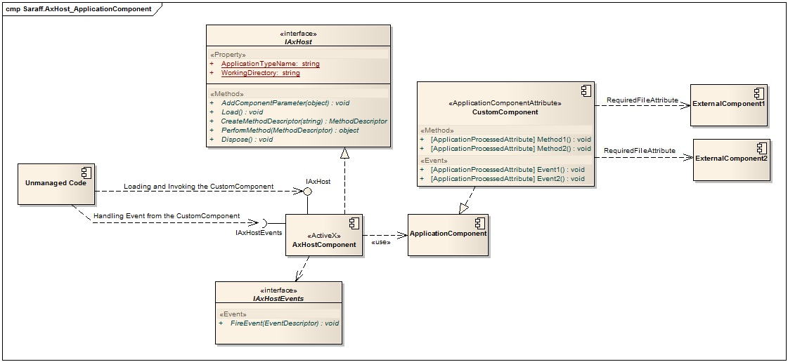

[All products](../)
# Saraff.AxHost.NET
Saraff.AxHost.NET Provides hosting for custom components (.NET) in applications with unmanaged code.

[download fullsize image](./content/Home_Saraff.AxHost_ApplicationComponent.jpg)

# Contents
* [Introduction](./Introduction.md)
* Attributes
	* [ApplicationComponentAttribute](./ApplicationComponentAttribute.md)
	* [ApplicationControlAttribute](./ApplicationControlAttribute.md)
	* [ApplicationProcessedAttribute](./ApplicationProcessedAttribute.md)
	* [RequiredFileAttribute](./RequiredFileAttribute.md)
* Base classes
	* [ApplicationComponent](./ApplicationComponent.md)
	* [ApplicationControl](./ApplicationControl.md)
* Hosting
	* [IAxHost](./IAxHost.md) interface
	* [IAxHostEvents](./IAxHostEvents.md) interface
	* [AxHostComponent](./AxHostComponent.md)
	* [AxHostControl](./AxHostControl.md)
* [Method Invocation](./Method-Invocation.md)
* [Event Processing](./Event-Processing.md)

# References
* [Create ActiveX in .NET Step by Step](http://www.codeproject.com/Articles/24089/Create-ActiveX-in-NET-Step-by-Step)
* [How to develop and deploy ActiveX control in C#](http://blogs.msdn.com/b/asiatech/archive/2011/12/05/how-to-develop-and-deploy-activex-control-in-c.aspx)
