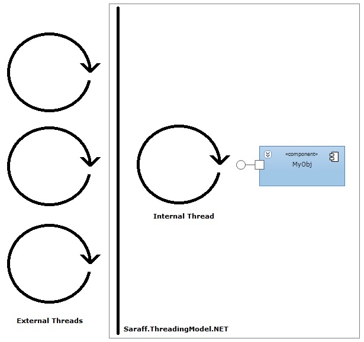

[All products](../)
# Saraff.ThreadingModel.NET
Saraff.ThreadingModel.NET is the skillful component which represents a single threading synchronization.

# The examples
```c#
var _myObj=new SingleThreadedProxy(typeof(MyObj)).GetTransparentProxy() as MyObj
```

```c#
var _myObj=new SingleThreadedProxy(typeof(MyObj), param1, param2 /**, ...**/).GetTransparentProxy() as MyObj
```

```c#
var _myObj=new SingleThreadedProxy(new MyObj(/**...**/)).GetTransparentProxy() as MyObj
```
