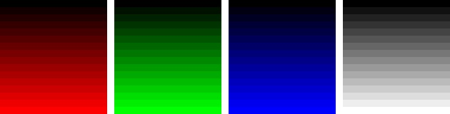

[All products](../) / [Saraff.Tiff.NET](./index.md)
# Writer
```c#
using(var _stream=File.Create("sample.tif")) {
    var _writer=TiffWriter.Create(_stream);

    var _handle=_writer.WriteHeader(); // Write Header

    for(int _page=0; _page<4; _page++) {
        var _strips=new TiffHandle[16];
        var _stripByteCounts=new uint[16];
        for(byte i=0; i<_strips.Length; i++) {
            var _buf=new byte[Program._imageWidth*(Program._imageHeight/_strips.Length)*3];
            
            // Generating data ...

            _strips[i]=_writer.WriteData(_buf); // Write Strip
            _stripByteCounts[i]=(uint)_buf.Length;
        }

        // Write Image File Directory
        _handle=_writer.WriteImageFileDirectory(_handle, new Collection<ITag> {
            Tag<uint>.Create(TiffTags.ImageWidth,Program._imageWidth),
            Tag<uint>.Create(TiffTags.ImageLength,Program._imageHeight),
            Tag<ushort>.Create(TiffTags.BitsPerSample,8,8,8),
            Tag<TiffCompression>.Create(TiffTags.Compression,TiffCompression.NONE),
            Tag<TiffPhotoMetric>.Create(TiffTags.PhotometricInterpretation,TiffPhotoMetric.RGB),
            Tag<TiffHandle>.Create(TiffTags.StripOffsets,_strips),
            Tag<ushort>.Create(TiffTags.SamplesPerPixel,3),
            Tag<uint>.Create(TiffTags.RowsPerStrip,Program._imageHeight/16),
            Tag<uint>.Create(TiffTags.StripByteCounts,_stripByteCounts),
            Tag<ulong>.Create(TiffTags.XResolution,(1UL<<32)|300UL),
            Tag<ulong>.Create(TiffTags.YResolution,(1UL<<32)|300UL),
            Tag<TiffResolutionUnit>.Create(TiffTags.ResolutionUnit,TiffResolutionUnit.INCH),
            Tag<char>.Create(TiffTags.Software,"SARAFF SOFTWARE".ToCharArray()),
            Tag<char>.Create(TiffTags.Copyright,"(c) SARAFF 2014".ToCharArray())
        });
    }
}
```


[Download Image File](./content/Home_test.tif)
