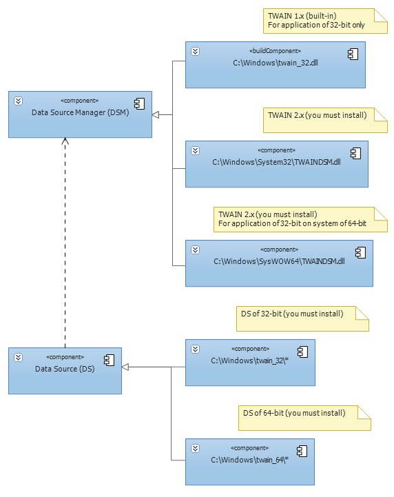

# Installation of the Data Source Manager
All TWAIN 2.x Applications must use TWAINDSM.DLL. For TWAIN 1.x Applications use TWAIN_32.DLL.

Applications that wish to use access the Data Source Manager, must install it themselves. Please refer to the TWAIN website [http://www.twain.org](http://www.twain.org) to obtain this file and for installation instructions. This DSM is fully backwards compatible with all versions of TWAIN. The Application Installer may include a Data Source Manager merge module: [http://sourceforge.net/projects/twain-dsm/files/](http://sourceforge.net/projects/twain-dsm/files/).

The TWAIN DSM is a shared library named TWAINDSM.DLL. There is a 32-bit and a 64-bit version of this file. TWAINDSM.DLL is installed in the Windows System directory (normally C:\Windows\System32). If installing the 32-bit file on a 64-bit system, it needs to end up in the WOW64 System directory (normally C:\Windows\SysWow64). By including the TWAIN DSM merge module in the application installer, the DSM is installed in the correct location.

[Download Full Size Image](./content/Installation of the Data Source Manager_twain-32-64.jpg)

