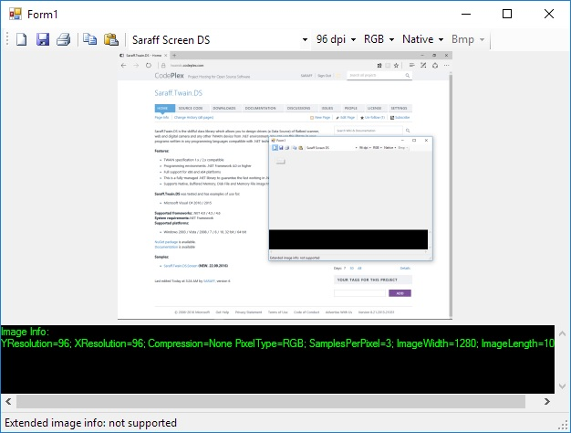

[All products](../)
# Saraff.Twain.DS
Saraff.Twain.DS is the skillful class library which allows you to design drivers (a Data Source) of flatbed scanner, web and digital camera and any other TWAIN device from .NET environment. You can use this library in your programs written in any programming languages compatible with .NET technology. 
## Features:
* TWAIN specification 1.x / 2.x compatible
* Programming environments: .NET Framework 4.0 or higher
* Full support for x86 and x64 platforms
* This is a fully-managed .NET library to guarantee the fast working in .NET Framework
* Supports Native, Buffered Memory, Disk File and Memory File image transfer mode
## Saraff.Twain.DS was tested and has examples of use for:
* Microsoft Visual 2015
* Microsoft Visual 2019
## Supported frameworks:
* **CLR v4.0**: .net 4.0 / 4.5 / 4.6
## System requirements:
* .NET Framework
## Supported platforms:
* Windows 2003 / Vista / 2008 / 7 / 8 / 10, 32-bit / 64-bit

## [NuGet package](https://www.nuget.org/packages/Saraff.Twain.DS/)
## [Documentation](./wiki/)

## [&nbsp;](#samples)Samples:
* [Saraff Screen DS](./download/Saraff.Twain.DS.Screen_1.0.2.690.zip) **(UPDATED. 22.12.2019)** ([TWAIN Certified Driver](https://resource.twain.org/twain-certified-drivers/entry/1650/))
* [Saraff DirectX DS](https://github.com/saraff-9EB1047A4BEB4cef8506B29BA325BD5A/Saraff.Twain.DS.DirectX) **(UPDATED. 07.03.2019)** ([TWAIN Certified Driver](https://resource.twain.org/twain-certified-drivers/entry/1649/))

**Figure 1 - Saraff.Twain.DS.Screen on Windows 10 x64**

# TWAIN Specification 
Saraff.Twain.DS implements [TWAIN 2.3 Specification](http://twain.org/specification). Explanation of [specification](http://twain.org/specification) is not the purpose of this project. Here will be explained features of the implementation of TWAIN specification.

_If you notice an error, please let me know about it._
