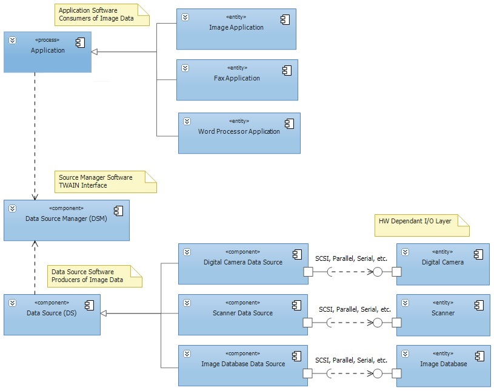

# Elements of TWAIN
TWAIN defines a standard software protocol and API (application programming interface) for
communication between software applications and image acquisition devices (the Data Source).
* **Application software**. An application must be modified to use TWAIN.
* **Source Manager software**. This software manages the interactions between the application and the Source. This code is provided in the TWAIN Developer’s Toolkit and should be shipped for free with each TWAIN application and Source.
* **Source software**. This software controls the image acquisition device and is written by the device developer to comply with TWAIN specifications. Traditional device drivers are now included with the Source software and do not need to be shipped by applications.

[Download Full Size Image](../content/Elements of TWAIN_twain-elements.jpg)

