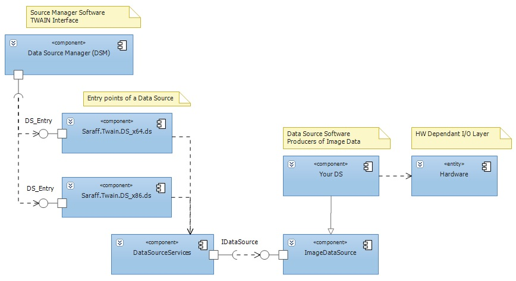

[All products](../../) / [Saraff.Twain.DS](../) / [Contents](./index.md)
# The structure of a Source
The Source is implemented as a Shared Library (DLL on Windows). The Source will not run stand-alone.

TWAIN data sources’ file name must end with a .DS extension. The Source Manager recursively searches for all Sources in the TWAIN sub-directory. To reduce the chance for naming collisions, each Source should create a sub-directory beneath TWAIN, giving it a name relevant to their product.

Every Source is required to have a single entry point called DS_Entry.

The DataSourceServices controls the TWAIN session (It returns the identity structure for the Source; Opens the Source for operation; Closes the Source so it can be unloaded from memory; Returns the current Condition Code for the specified Source).

[Download Full Size Image](../content/The Structure of a Source_ds-structure.jpg)

