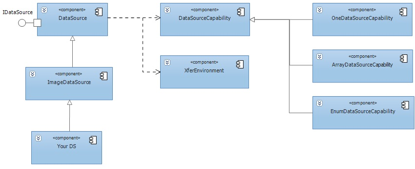
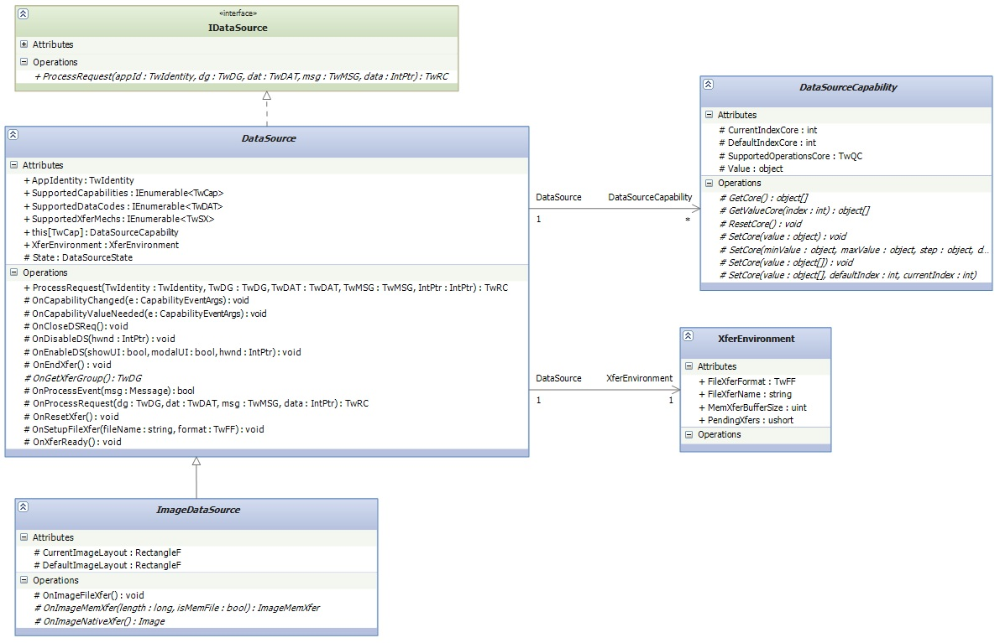

# The framework of a Source
* The **DataSource** is base class that implements the core functionality of a any Data Sources, it implements a IDataSource interface.
* The **ImageDataSource** controls the image acquisition device (Control information on the physical layout of the image; Provides specific image description information about the current image; Transfer of an image from the Source to the application).
* The **XferEnvironment** provide information about current transfer environment (Information about the current image that has just been transferred; Number of transfers the Source is ready to supply to the application, upon demand; Buffer size for a memory transfer mode; File name and format for a file transfer mode).
* The **DataSourceCapability** provide basic functionality for a capabilities classes.

[Download Full Size Image](../content/The framework of a Source_ds-structure2.jpg)

[Download Full Size Image](../content/The framework of a Source_ds-classes.jpg)
