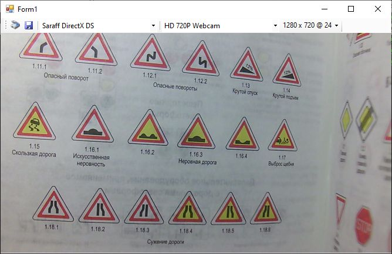

[All products](../) / [Saraff DirectX DS](./index.md)
# Saraff.Twain.CapSample

The Saraff DirectX DS supports follows custom capabilities

```c#
private static class CustomCap {
    public const TwCap VideoDevices = (TwCap)0x9001;
    public const TwCap FrameWidth = (TwCap)0x9002;
    public const TwCap FrameHeight = (TwCap)0x9003;
    public const TwCap FrameBpp = (TwCap)0x9004;
    public const TwCap IsRunning = (TwCap)0x9005;
}
```

## VideoDevices (0x9001)
Return list of video capture devices.

Type: TW_STR255
Supported Operations and Containers
* MSG_GET           TW_ENUMERATION
* MSG_GETCURRENT    TW_ONEVALUE
* MSG_GETDEFAULT    TW_ONEVALUE
* MSG_SET           TW_ONEVALUE

## FrameWidth (0x9002)
Return list of frame widths for current video capture device

Type: TW_FIX32
Supported Operations and Containers
* MSG_GET           TW_ENUMERATION
* MSG_GETCURRENT    TW_ONEVALUE
* MSG_GETDEFAULT    TW_ONEVALUE
* MSG_SET           TW_ONEVALUE

## FrameHeight (0x9003)
Return list of frame heights for current video capture device and current frame width

Type: TW_FIX32
Supported Operations and Containers
* MSG_GET           TW_ENUMERATION
* MSG_GETCURRENT    TW_ONEVALUE
* MSG_GETDEFAULT    TW_ONEVALUE
* MSG_SET           TW_ONEVALUE

## FrameBpp (0x9004)
Return list of frame bpp (bits per pixel) for current video capture device, current frame width and current frame height

Type: TW_FIX32
Supported Operations and Containers
* MSG_GET           TW_ENUMERATION
* MSG_GETCURRENT    TW_ONEVALUE
* MSG_GETDEFAULT    TW_ONEVALUE
* MSG_SET           TW_ONEVALUE

## IsRunning (0x9005)
Return true if current video capture device is running; otherwise false 

Type: TW_BOOL
Supported Operations and Containers
* MSG_GET           TW_ENUMERATION
* MSG_GETCURRENT    TW_ONEVALUE
* MSG_GETDEFAULT    TW_ONEVALUE
* MSG_SET           TW_ONEVALUE

## [Saraff.Twain.CapSample](https://github.com/saraff-9EB1047A4BEB4cef8506B29BA325BD5A/Saraff.Twain.DS.DirectX/tree/master/Saraff.Twain.CapSample)


**Figure 1 - Saraff.Twain.CapSample application**

For making snapshot you must click to the Acquire button (on toolstrip panel) and then press shutter button (on camera)