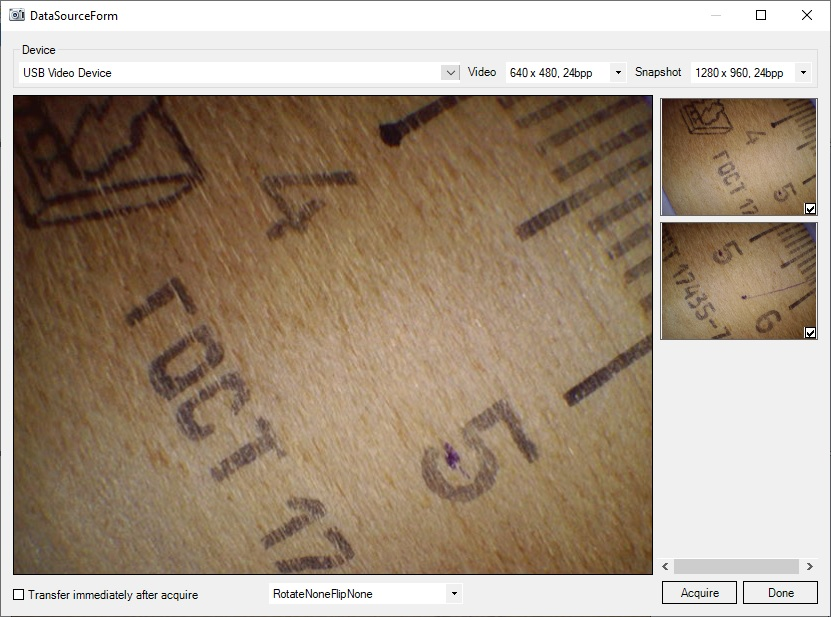

[All products](../)
# Saraff DirectX DS (Saraff.Twain.DS.DirectX)
Saraff DirectX DS is TWAIN Data Source that capturing video from a USB web camera and making snapshots using it 
(the camera must have a shutter button for making snapshots). 
## Features:
* TWAIN specification 2.3 compatible
* [TWAIN Certified Driver](https://resource.twain.org/twain-certified-drivers/entry/1649/)
* Programming environments: .NET Framework 4.0 or higher
* Full support for x86 and x64 platforms
* This is a fully-managed .NET library to guarantee the fast working in .NET Framework
* Supports Native, Buffered Memory, Disk File and Memory File image transfer mode
* Supports selection of video capture devices and video settings
* Supports the UI and non-UI modes
* Supports the custom capabilities (for non-UI mode. See [Saraff.Twain.CapSample](https://github.com/saraff-9EB1047A4BEB4cef8506B29BA325BD5A/Saraff.Twain.DS.DirectX/tree/master/Saraff.Twain.CapSample))
## System requirements:
* .NET Framework 4.0 or higher
## Supported platforms:
* Windows 2003 / Vista / 2008 / 7 / 8 / 10, 32-bit / 64-bit
## See also
* [Saraff DirectX DS](https://github.com/saraff-9EB1047A4BEB4cef8506B29BA325BD5A/Saraff.Twain.DS.DirectX) Project Page
* [Custom capabilities](./capsample.md) of Saraff DirectX DS

**Figure 1 - Saraff DirectX DS on Windows 10 x64**

# TWAIN Specification 
Saraff.Twain.DS implements [TWAIN 2.3 Specification](http://twain.org/specification). Explanation of [specification](http://twain.org/specification) is not the purpose of this project. Here will be explained features of the implementation of TWAIN specification.

_If you notice an error, please let me know about it._
