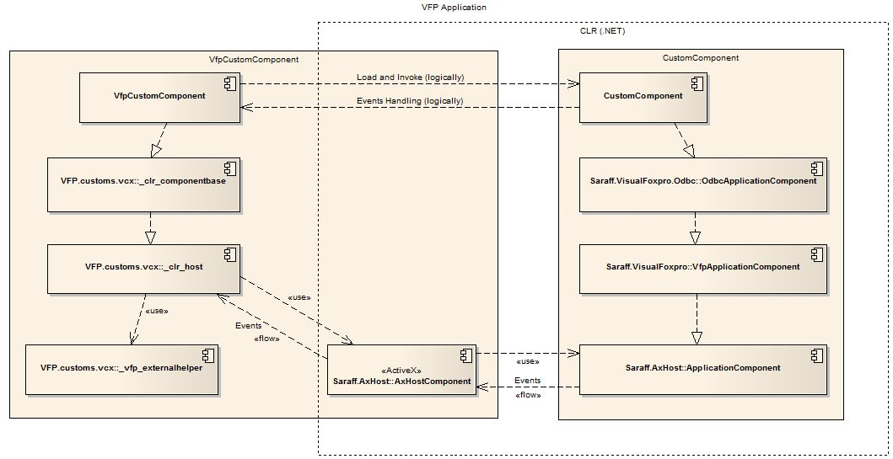
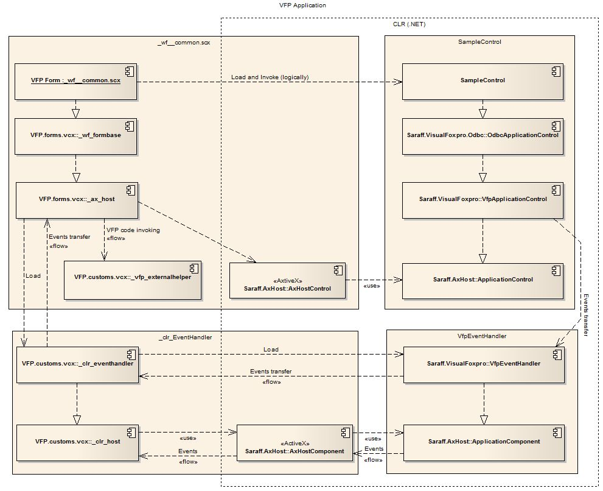

# Saraff.VisualFoxpro.NET
Saraff.VisualFoxpro.NET is a Hosting .NET Components in a Visual Foxpro.
## Features
* Host the .NET Runtime directly inside of Visual FoxPro
* Don't requires no COM Registration for .NET objects instantiation
* Supports calling methods .NET components from VFP code
* Supports calling VFP code from .NET components
* Supports processing .NET event in VFP code
## Hosting a .NET Component on a VFP Custom

[download fullsize image](./content/Home_vfp_1.jpg)

## Hosting a .NET Control on a VFP Form

[download fullsize image](./content/Home_vfp_2.jpg)
